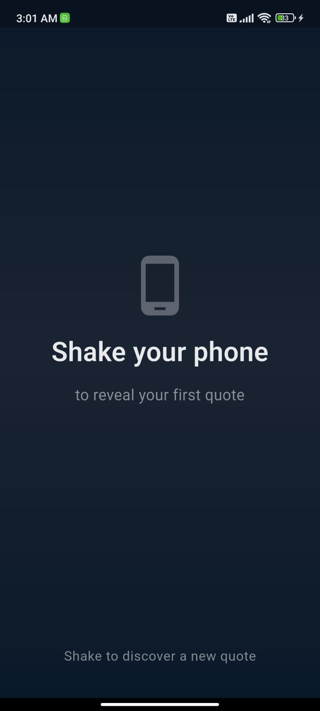
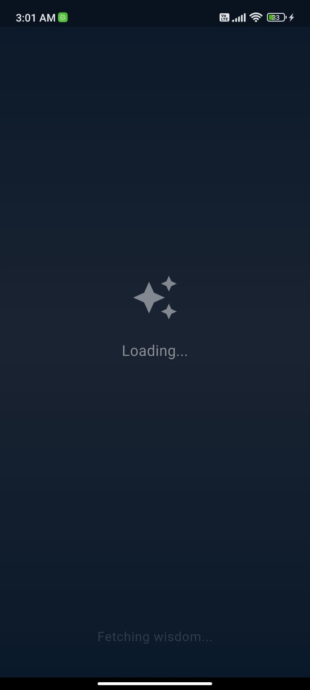
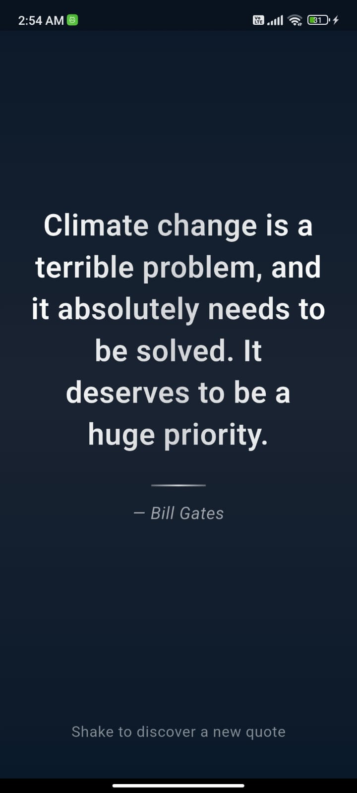

# 📱 Shake Quote App

A beautiful Flutter application that displays random inspirational quotes when you shake your device. This app demonstrates **Flutter Platform Channels** integration with native Android code for shake detection.


## ✨ Features

- 🤝 **Native Platform Integration**: Uses Android's accelerometer sensor via Flutter EventChannel
- 📳 **Real-time Shake Detection**: Detects device shake gestures natively
- 🔄 **State Management**: BLoC/Cubit pattern for clean architecture
- 🌐 **REST API Integration**: Fetches quotes from FavQs API using Dio
- 💫 **Smooth Animations**: Pulsing loaders, fade transitions, and bouncing effects
- 📊 **Logger Integration**: Comprehensive logging for debugging

## 📸 Screenshots

| Empty State | Loading | Quote Display |
|------------|---------|---------------|
|  |  |  |

---

## 🏗️ Architecture

### Flutter Native Integration (Platform Channels)

This app uses **EventChannel** to stream shake events from native Android code to Flutter:

```
┌─────────────────────────────────────────┐
│          Flutter (Dart Layer)           │
│  ┌───────────────────────────────────┐  │
│  │     EventChannel Listener         │  │
│  │   "com.example/shake"            │  │
│  └───────────┬───────────────────────┘  │
│              │ Stream<Map>               │
└──────────────┼───────────────────────────┘
               │
    Platform Channel (EventChannel)
               │
┌──────────────┼───────────────────────────┐
│              ▼                            │
│  ┌───────────────────────────────────┐  │
│  │   ShakeStreamHandler (Kotlin)     │  │
│  │   - Accelerometer Sensor          │  │
│  │   - Shake Detection Algorithm     │  │
│  │   - Event Emission                │  │
│  └───────────────────────────────────┘  │
│       Native Android (Kotlin Layer)      │
└─────────────────────────────────────────┘
```

### Project Structure

```
lib/
├── main.dart                    # App entry point
├── screens/
│   └── qoute_home.dart         # Main screen
├── widgets/                     # Reusable UI components
│   ├── animated_heart_icon.dart
│   ├── empty_state_widget.dart
│   ├── error_widget.dart
│   ├── pulsing_loading_widget.dart
│   └── quote_display_widget.dart
├── logic/                       # Business logic
│   ├── shake_cubit.dart        # State management
│   └── sake_state.dart         # App states
├── models/
│   └── qoute_model.dart        # Data models
├── services/
│   ├── quote_service.dart      # API service
│   └── looger.dart             # Logging utility
├── channel_services/
│   └── communication_service.dart # EventChannel wrapper
└── utils/
    └── app_logger.dart         # Logger configuration

android/
└── app/src/main/kotlin/.../
    └── MainActivity.kt          # Native shake detection
```

## 🔌 Native Integration Details

### EventChannel Implementation

**Flutter Side (Dart):**

```dart
// communication_service.dart
class ShakeDetectorStream {
  static const _eventChannel = EventChannel('com.example/shake');

  static Stream<Map<String, dynamic>> shakeEvents() {
    return _eventChannel.receiveBroadcastStream().map((event) {
      return Map<String, dynamic>.from(event as Map);
    });
  }
}
```

**Android Side (Kotlin):**

```kotlin
// MainActivity.kt
class MainActivity : FlutterActivity() {
    override fun configureFlutterEngine(flutterEngine: FlutterEngine) {
        super.configureFlutterEngine(flutterEngine)
        
        EventChannel(
            flutterEngine.dartExecutor.binaryMessenger,
            "com.example/shake"
        ).setStreamHandler(ShakeStreamHandler(this))
    }
}

class ShakeStreamHandler(context: Context) : EventChannel.StreamHandler {
    // Uses Android SensorManager for accelerometer data
    // Calculates g-force to detect shake gestures
    // Emits events to Flutter via EventSink
}
```

### Shake Detection Algorithm

```kotlin
val gForce = sqrt(x² + y² + z²) / GRAVITY_EARTH

if (gForce > 2.7 && timeSinceLastShake > 800ms) {
    // Shake detected! Send event to Flutter
    events?.success(mapOf(
        "count" to shakeCount,
        "gForce" to gForce,
        "timestampMs" to currentTimeMs
    ))
}
```

## 🚀 Getting Started

### Prerequisites

- Flutter SDK (>=3.0.0)
- Android Studio / VS Code
- Android SDK
- Dart SDK

### Installation

1. **Clone the repository**

```bash
git clone https://github.com/yourusername/shake_quote_app.git
cd shake_quote_app
```

2. **Install dependencies**

```bash
flutter pub get
```

3. **Add your FavQs API Key**

Open `lib/services/quote_service.dart` and replace:

```dart
static const _apiKey = 'YOUR_API_KEY_HERE';
```

Get your free API key from: https://favqs.com/api

4. **Run the app**

```bash
flutter run
```

## 📦 Dependencies

```yaml
dependencies:
  flutter:
    sdk: flutter
  flutter_bloc: ^8.1.3      # State management
  dio: ^5.4.0               # HTTP client
  logger: ^2.0.2            # Logging

dev_dependencies:
  flutter_test:
    sdk: flutter
  flutter_lints: ^3.0.0
```

## 🎯 Key Concepts Demonstrated

### 1. **Platform Channels (EventChannel)**
- Continuous data streaming from native to Flutter
- Bidirectional communication
- Native sensor integration

### 2. **BLoC Pattern**
```dart
ShakeCubit
├── States (ShakeState)
├── Events (Shake detected)
└── Business Logic (Fetch quotes)
```

### 3. **Clean Architecture**
- Separation of UI, logic, and data layers
- Dependency injection
- Testable code structure

### 4. **Animations**
- `AnimatedSwitcher` for smooth transitions
- Custom animation controllers
- Tween animations

### 5. **Error Handling**
- Network error handling with Dio
- User-friendly error messages
- Retry mechanisms

## 🔧 Configuration

### Adjust Shake Sensitivity

In `MainActivity.kt`:

```kotlin
// Lower value = more sensitive (default: 2.7)
if (gForce > 2.7) {
    // Shake detected
}

// Minimum time between shakes (default: 800ms)
if (now - lastShakeTime > 800) {
    // Process shake
}
```

### Change Theme

In `main.dart`:

```dart
ThemeData(
  useMaterial3: true,
  brightness: Brightness.dark,
  scaffoldBackgroundColor: const Color(0xFF0A1929),
)
```

## 📱 Testing

### Test on Physical Device

Shake detection requires a **physical device** with an accelerometer. Emulators don't support shake gestures.

```bash
flutter run --release
```

### Debug Logs

The app uses the `logger` package for comprehensive logging:

```
💡 INFO: 📳 SHAKE DETECTED! Count: 1, gForce: 3.45
💡 INFO: 🌐 REQUEST: GET https://favqs.com/api/quotes
💡 INFO: ✅ RESPONSE: 200
💡 INFO: ✨ Quote fetched: "..." - Steve Jobs
```

## 🐛 Troubleshooting

### Issue: "No implementation found for method listen"

**Solution:** 
- Ensure `MainActivity.kt` package name matches `AndroidManifest.xml`
- Run `flutter clean && flutter run`

### Issue: Shake not detected

**Solution:**
- Test on a physical device (not emulator)
- Increase shake sensitivity (lower gForce threshold)
- Check sensor permissions in AndroidManifest.xml

### Issue: API errors

**Solution:**
- Verify API key is correct
- Check internet connection
- Review rate limits (25 requests/hour for free tier)

## 📚 Learning Resources

- [Flutter Platform Channels](https://docs.flutter.dev/platform-integration/platform-channels)
- [EventChannel Documentation](https://api.flutter.dev/flutter/services/EventChannel-class.html)
- [BLoC Pattern](https://bloclibrary.dev/)
- [Android Sensor Manager](https://developer.android.com/guide/topics/sensors/sensors_motion)

## 🤝 Contributing

Contributions are welcome! Please feel free to submit a Pull Request.

1. Fork the project
2. Create your feature branch (`git checkout -b feature/AmazingFeature`)
3. Commit your changes (`git commit -m 'Add some AmazingFeature'`)
4. Push to the branch (`git push origin feature/AmazingFeature`)
5. Open a Pull Request

## 📄 License

This project is licensed under the MIT License - see the [LICENSE](LICENSE) file for details.

## 👨‍💻 Author

**Your Name**
- GitHub: [@ZiadAhmedH](https://github.com/ZiadAhmedH)

⭐ **Star this repo if you find it helpful!**

**Made with ❤️ and Flutter**
